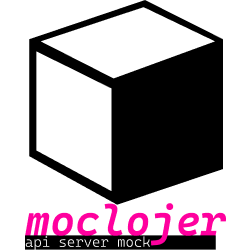

[](https://github.com/avelino/moclojer)

Simple and efficient HTTP mock server with specification in `yaml`, `edn` or `OpenAPI`.

> 💾 Download the binary with the latest version of moclojer to test on your computer [here](https://github.com/avelino/moclojer/releases/latest).

[](https://github.com/avelino/moclojer/actions/workflows/tests.yml)
[](https://github.com/avelino/moclojer/actions/workflows/linter.yml)

**[📖 See the complete documentation for moclojer here](https://avelino.run/projects/moclojer/)**, if you want to
contribute (or complement) the documentation, it
is [here](https://github.com/avelino/avelino.run/blob/main/content/projects/moclojer.md).

# Usage

**`YAML` example**

```yaml
# This mock register route: GET /hello/:username
- endpoint:
    # Note: the method could be omitted because GET is the default
    method: GET
    path: /hello/:username
    response:
      # Note: the status could be omitted because 200 is the default
      status: 200
      headers:
        Content-Type: application/json
      # Note: the body will receive the value passed in the url using the
      # :username placeholder
      body: >
        {
          "hello": "{{path-params.username}}!"
        }
```

## With OpenAPI

With a valid OpenAPI file schema `simple-api.json`

```json
{
  "openapi": "3.0.0",
  "info": {
    "title": "Sample API",
    "version": "1.0"
  },
  "paths": {
    "/hello": {
      "get": {
        "operationId": "greet",
        "responses": {
          "200": {
            "description": "A JSON array of user names",
            "content": {
              "application/json": {
                "schema": {
                  "type": "object",
                  "required": [
                    "hello"
                  ],
                  "properties": {
                    "hello": {
                      "type": "string"
                    }
                  }
                }
              }
            }
          }
        }
      }
    }
  }
}
```

Create a `mocks.json` file, with the content

```json
{
  "myFirstRoute": {
    "body": "{\"hello\": \"{{path-params.username}}!\"}",
    "headers": {
      "Content-Type": "application/json"
    },
    "status": 200
  }
}
```

Then run `CONFIG=simple-api.json MOCKS=mocks.json <<moclojer command>>`

## Form upload support

On both `moclojer.yml` or `mocks.json` you can add a `store` key to enable multipart uploads on the route and save the
content in a dir.

```yaml
- endpoint:
    method: POST
    path: /hello/:username
    response:
      ## Will save all parameters at ./form-uploads directory
      store: form-uploads
      status: 200
      headers:
        Content-Type: application/json
      body: >
        {
          "hello": "{{path-params.username}}!"
        }
```

```json
{
  "myFormRoute": {
    "store": "formRoute",
    "headers": {
      "Content-Type": "application/json"
    },
    "status": 303
  }
}
```

## docker

**image:** `ghcr.io/avelino/moclojer:latest`

```sh
docker run -it \
  -v $(pwd)/moclojer.yml:/app/moclojer.yml \
  ghcr.io/avelino/moclojer:latest
```

## 💻 dev environment

We use git submodule for integration with the [**OpenAPI v3** specification](https://github.com/OAI/OpenAPI-Specification), you need to update the git submodule code.

```sh
git submodule update -f --init
```

### run

```sh
clj -X:run
```

### test

```sh
clj -M:test
```

### `moclojer.jar` generate

```sh
clj -A:dev -M --report stderr -m moclojer.build
```
